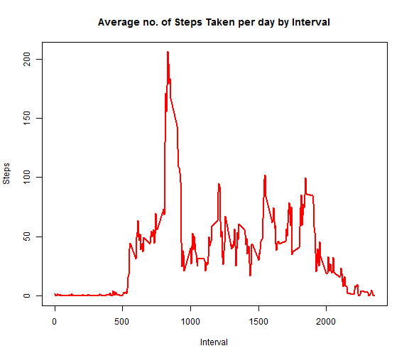

## **Reproducible Research - Assignment 1** 

## Loading and preprocessing data


```r
# Read activity.csv file into "activity" variable
activity <- read.csv(file="./data/activity.csv")
activity$date <- as.Date(activity$date)

# Load reshape2 library to get melt & dcast functions
library(reshape2)

# Melt data frame to prep for casting by date -- 
actMeltDate <- melt(activity, id.vars="date", measure.vars="steps", na.rm=FALSE)

# Cast data frame to see steps per day
actCastDate <- dcast(actMeltDate, date ~ variable, sum)
```
## What is mean total number of steps taken per day?


```r
# 1. Plot histogram with Total no. of steps taken each day 
plot(actCastDate$date, actCastDate$steps, type="h", main="Histogram of Daily Steps", xlab="Date", ylab="Steps per Day", col="black", lwd=6)
```

 

```r
# 2. Calculate and report the mean and median total number of steps taken per day
rmean <-  mean(actCastDate$steps, na.rm=TRUE)
rmean <- round (rmean, 2)
rmedian <- median(actCastDate$steps, na.rm=TRUE)
rmedian <- round (rmedian, 2)
```
For total number of steps taken per day, 
* the mean is 1.076619 &times; 10<sup>4</sup> and 
* The median is 1.0765 &times; 10<sup>4</sup>

## What is the average daily activity pattern?


```r
# Re-melt data frame to prep for casting by interval
actMeltInt <- melt(activity, id.vars="interval", measure.vars="steps", na.rm=TRUE)

# Cast data frame to see mean steps per interval
actCastInt <- dcast(actMeltInt, interval ~ variable, mean)

#1.Plot line chart with average frequency of steps by interval and add line with mean
plot(actCastInt$interval, actCastInt$steps, type="l", main="Average no. of Steps Taken per day by Interval", xlab="Interval", ylab="Steps", col="red", lwd=2)
```

 

```r
#2.Which 5-minute interval, on average across all the days in the dataset, contains the maximum number of steps?
paste("Interval with max no. of steps =", actCastInt$interval[which(actCastInt$steps == max(actCastInt$steps))])
```

```
## [1] "Interval with max no. of steps = 835"
```
## Imputing missing values


```r
# Calculate number of rows in activity data set with NA rows
paste ("Total No. of Rows with NA =", sum(is.na(activity$steps)))
```

```
## [1] "Total No. of Rows with NA = 2304"
```
### Strategy for filling in missing values - Use the mean for that 5-minute interval.


```r
#3.Create a new dataset that is equal to the original dataset but with the missing data filled in
# Data frame with mean steps per interval 
stepsPerInt <- actCastInt
# Create data frame WO NAs
actNoNA <- activity

# Merge activity data set with stepsPerInt data set
actMerge = merge(actNoNA, stepsPerInt, by="interval", suffixes=c(".act", ".spi"))

# Get list of indexes where steps value = NA
naIndex = which(is.na(actNoNA$steps))

# Replace NA values with value from steps.spi
actNoNA[naIndex,"steps"] = actMerge[naIndex,"steps.spi"]
# Plot histogram again with NA repalced
# Melt new data frame to prep for casting by date
actMeltDateNoNA <- melt(actNoNA, id.vars="date", measure.vars="steps", na.rm=FALSE)

# Cast data frame to see steps per day
actCastDateNoNA <- dcast(actMeltDateNoNA, date ~ variable, sum)

# Plot histogram with steps by date
plot(actCastDateNoNA$date, actCastDateNoNA$steps, type="h", main="Histogram of Daily Steps (after Imputing NA Values)", xlab="Date", ylab="Steps", col="blue", lwd=6)
```

 

```r
# Calculate mean and median of daily steps
rmean_i <- mean(actCastDateNoNA$steps, na.rm=TRUE)
rmedian_i <- median(actCastDateNoNA$steps, na.rm=TRUE)
rmedian_i <- round(rmedian_i, 2)
rmean_i <- round(rmean_i, 2)
```
### Note the difference in values:

Calculate difference between imputed and non-imputed data.

```r
mean_diff <- rmean_i - rmean
med_diff <- rmedian_i - rmedian
```
* The imputed data mean is 1.08898 &times; 10<sup>4</sup> - which was 1.076619 &times; 10<sup>4</sup> for non-imputed data. 
* The imputed data median is 1.1015 &times; 10<sup>4</sup> - which was 1.0765 &times; 10<sup>4</sup> for non-imputed data.
* The difference between the non-imputed mean and imputed mean is 123.61 .
* The difference between the non-imputed mean and imputed mean is 250 .


## Are there differences in activity patterns between weekdays and weekends?

Created a plot to compare and contrast number of steps between the week and weekend.


```r
# For loop to create new column called "dayOfWeek" and insert whether each date corresponds to a weekday or weekend
for (i in 1:nrow(actNoNA)) {
    if (weekdays(actNoNA$date[i]) == "Saturday" | weekdays(actNoNA$date[i]) == "Sunday") {
        actNoNA$dayOfWeek[i] = "weekend"
    } else {
        actNoNA$dayOfWeek[i] = "weekday"
    }
}

# To create a plot, we must first subset the data
actWeekday <- subset(actNoNA, dayOfWeek=="weekday")
actWeekend <- subset(actNoNA, dayOfWeek=="weekend")

# Next, we need to process the data for our needs
actMeltWeekday <- melt(actWeekday, id.vars="interval", measure.vars="steps")
actMeltWeekend <- melt(actWeekend, id.vars="interval", measure.vars="steps")
actCastWeekday <- dcast(actMeltWeekday, interval ~ variable, mean)
actCastWeekend <- dcast(actMeltWeekend, interval ~ variable, mean)

library(ggplot2)
library(gridExtra)

# Set plot area to two rows and one column, and then plot charts with mean line in each
plot1 <- qplot(actCastWeekday$interval, actCastWeekday$steps, geom="line", data=actCastWeekday, type="bar", main="Steps by Interval - Weekday", xlab="Interval", ylab="Number of Steps")
plot2 <- qplot(actCastWeekend$interval, actCastWeekend$steps, geom="line", data=actCastWeekend, type="bar", main="Steps by Interval - Weekend", xlab="Interval", ylab="Number of Steps")
grid.arrange(plot1, plot2, nrow=2)
```

 
### There is a higher peak earlier on weekdays, and more overall activity on weekends.  


